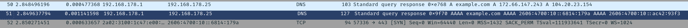

# Setup

The initial setup of the networking lab.

I have a simple script which launches an instance of the Chromium browser and sets up the SSLKEYLOGFILE so Chromium writes the keys required to decrypt the TLS traffic to a temporary file. We point Wireshark to this file so it knows what to use to decrypt the traffic.

After setting this up I started to capture traffic with Wireshark and ran the script and passed `https://example.com ` as the website to open. The Chromium window opened, I closed it and stopped the capture.

I use the `dns` filter to find the DNS requests to figure out what the IP address for `example.com` is. It showed both the `A` and `AAAA` requests. I removed the DNS filter to see what the first `SYN` packet after these requests were to know what IP it used to connect.

I verified that the traffic was being successfully unencrypted by Wireshark as I could see the `http2` row in the capture.
